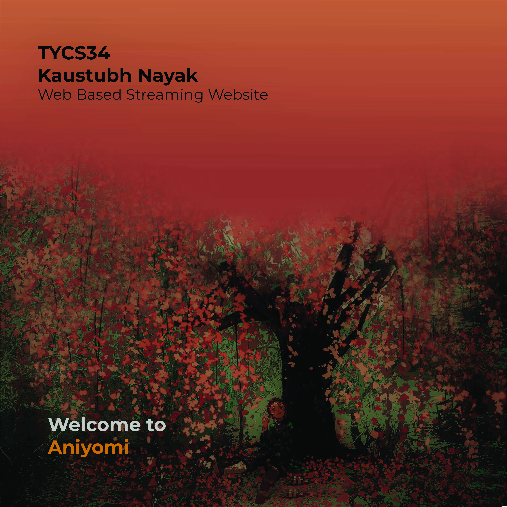
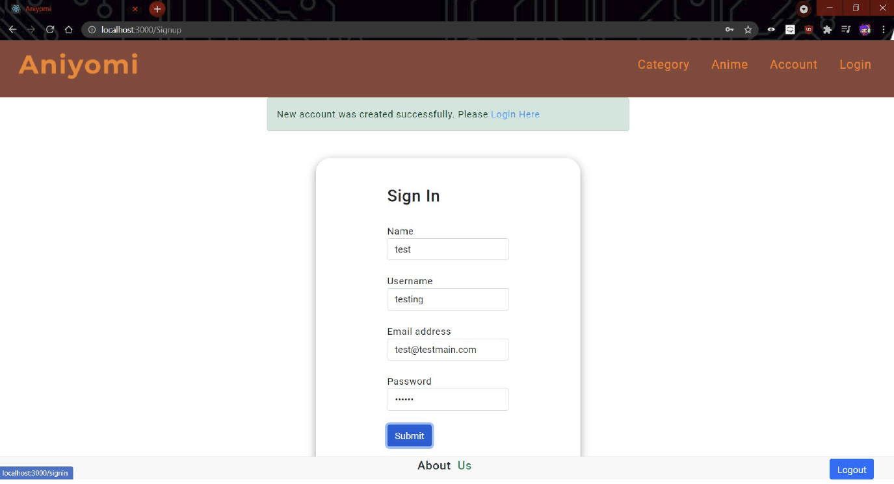
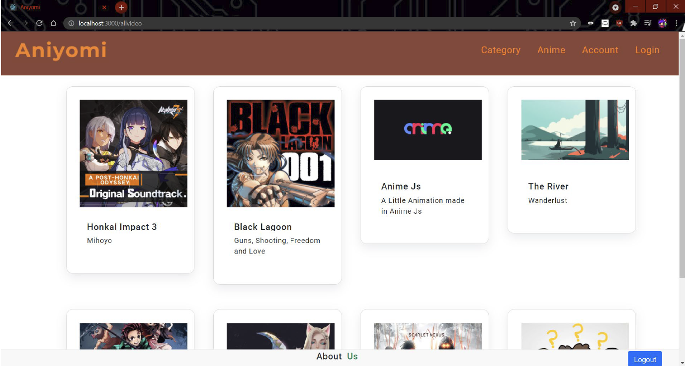
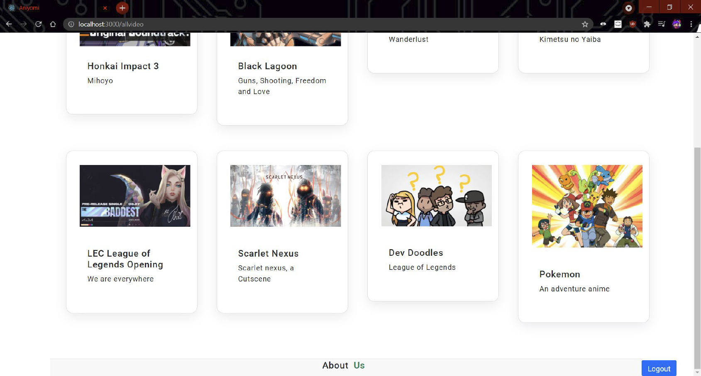
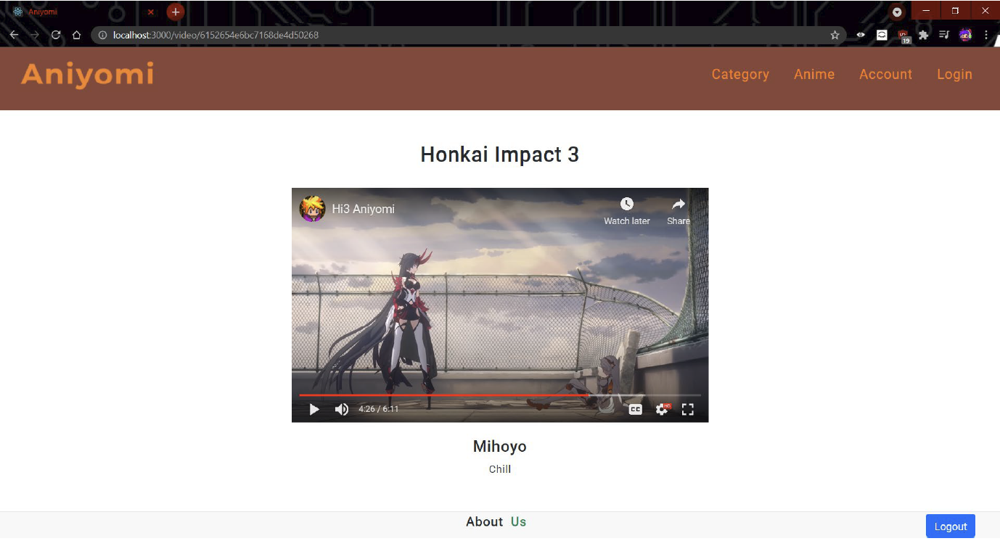
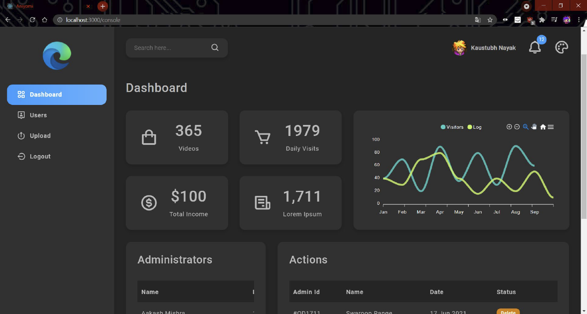

# Aniyomi

Aniyomi is a client-driven project introducing an anime streaming website with a distinct focus on promoting undiscovered gems from small authors and studios. The platform's essence lies in fostering a small, tight-knit community for niche audiences seeking unique and overlooked anime content.
  
I undertook this web development project for my bachelor's degree with the explicit goal of challenging myself to learn new technologies. Opting for the MERN stack. Although the journey was demanding, I successfully delivered the project, proving my ability to learn a completely new technology stack.

### Peek

  
Login Page
\

  
Repository - Using Mongodb and online hosting services as source
\

  
A modern type of player for ease of use
\

  
Admin Dashboard
\

### Features to add:

<li>Multilingual Search Features</li>
<li>Mood-Based Recommendations</li>
<li>Constant Community-Driven Reviews</li>
<li>Watch Parties</li>
<li>Advanced Player</li>

  

So far i have the basics down. Heres a

### sneakpeek

